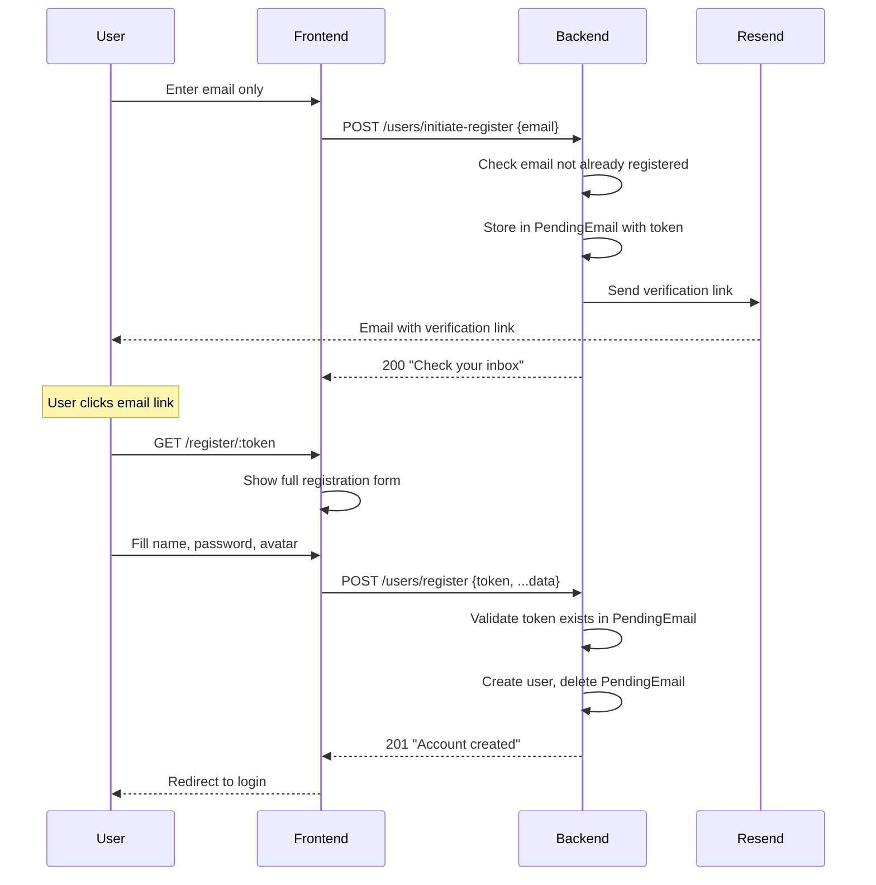
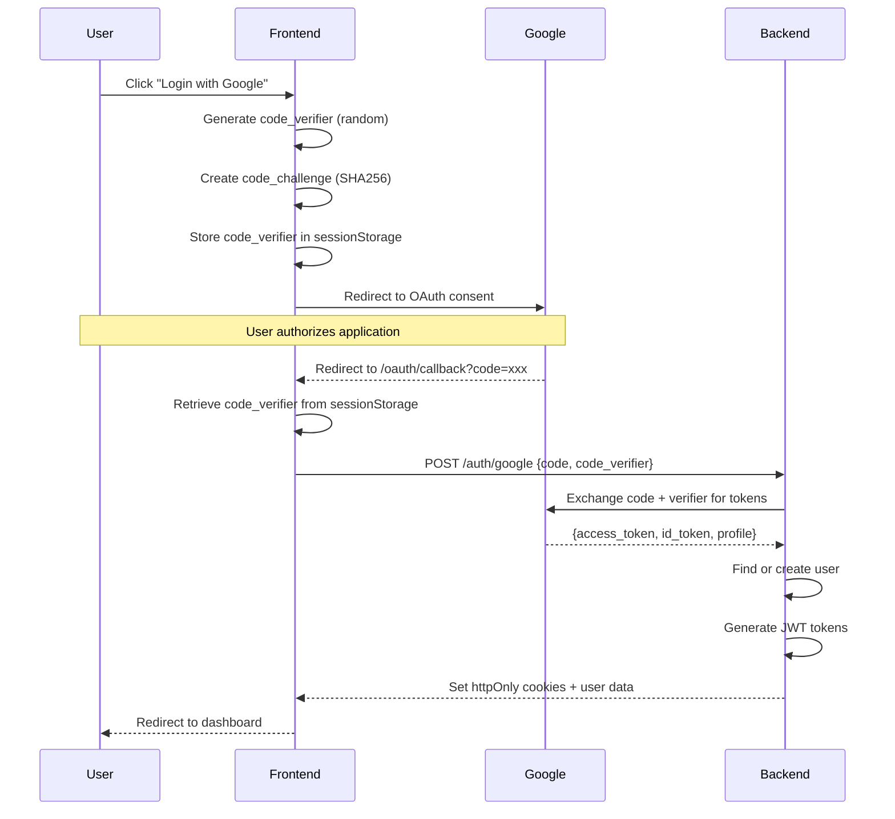
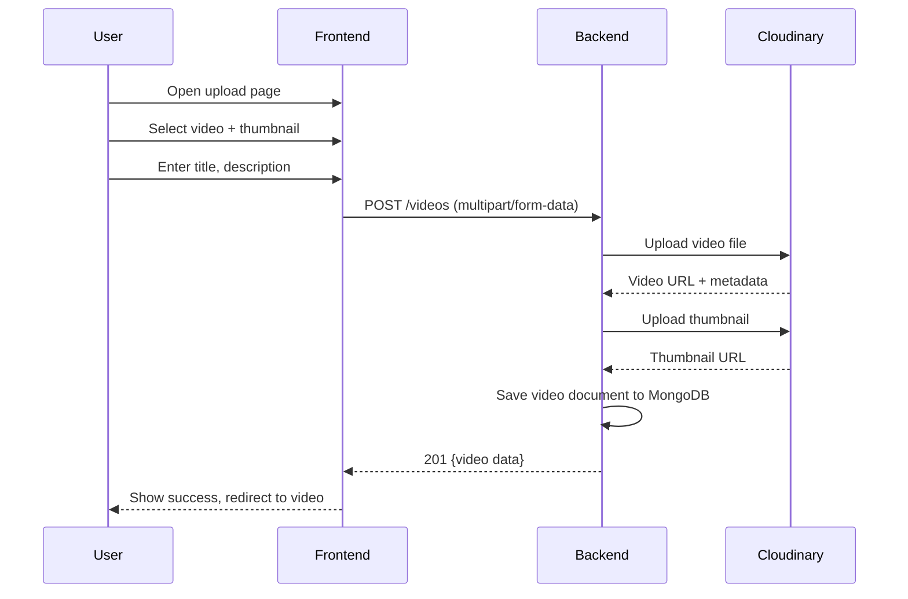
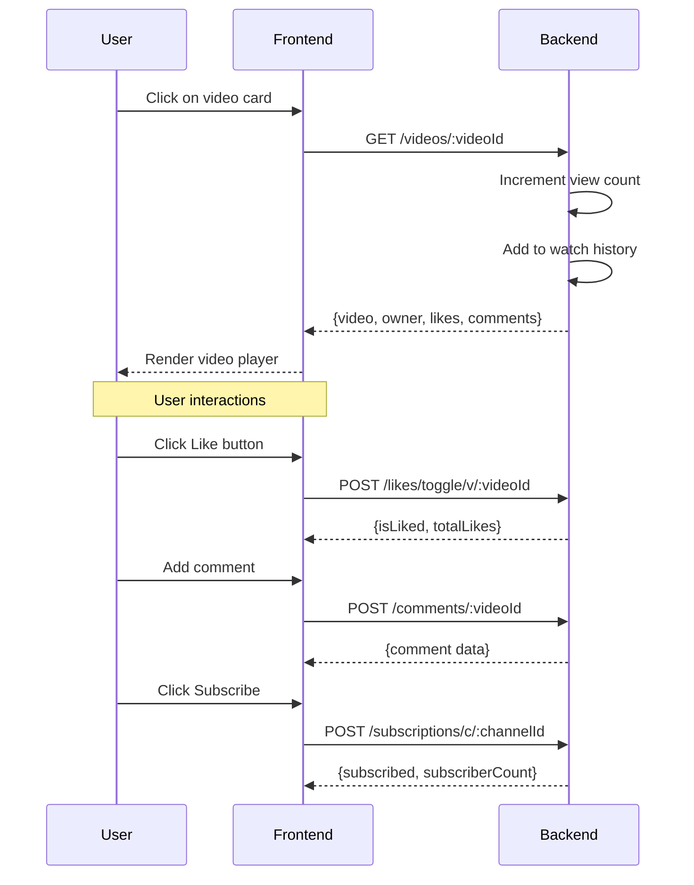
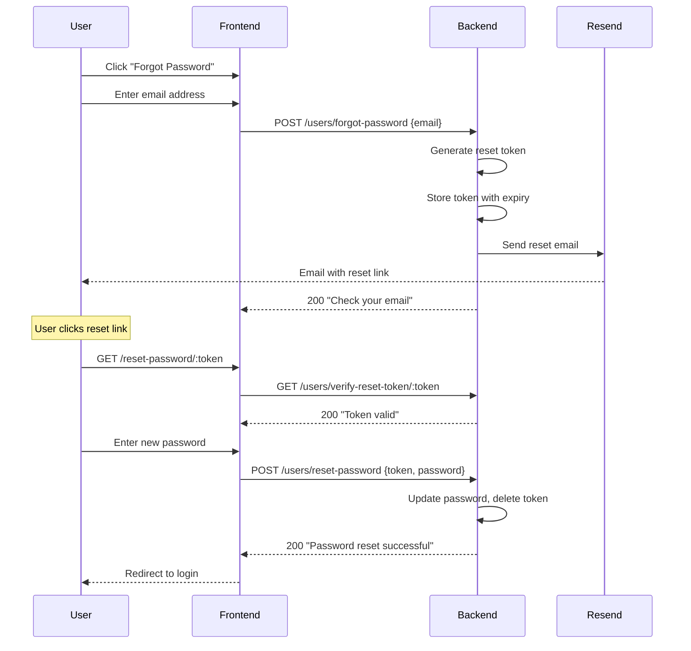
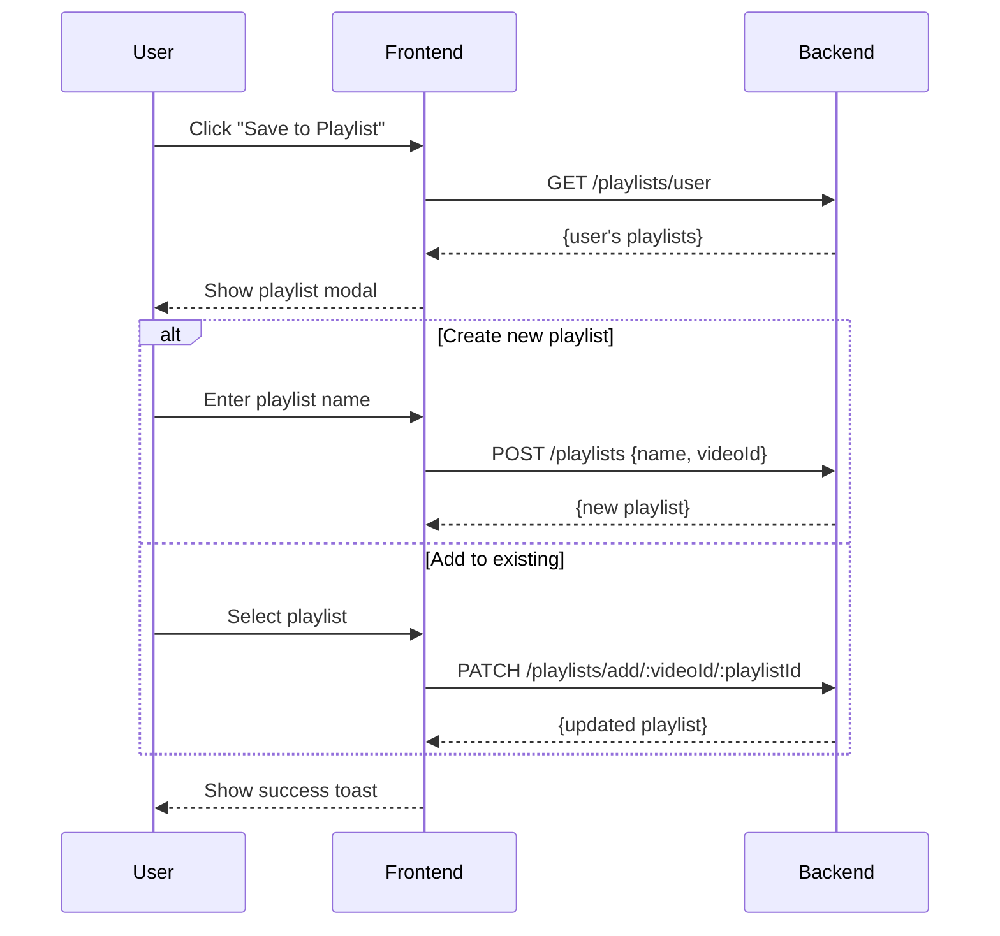

# 🎬 VidPlay

A modern, full-stack video sharing platform built with React and Node.js. Upload, share, and discover videos with a YouTube-like experience.

---

## ✨ Features

| Category | Features |
|----------|----------|
| **User Management** | Registration, Login, Google OAuth (PKCE), Password Reset, Email Verification |
| **Videos** | Upload, Edit, Delete, View, Search, Watch History |
| **Social** | Like/Unlike Videos & Comments, Subscribe to Channels |
| **Playlists** | Create, Edit, Delete, Add/Remove Videos |
| **Dashboard** | Channel Analytics, Video Management |

---

## 🛠️ Tech Stack

### Frontend
| Technology | Purpose |
|------------|---------|
| React 18 | UI Framework |
| Vite | Build Tool |
| Redux Toolkit | State Management |
| Tailwind CSS | Styling |
| React Router | Navigation |
| Axios | HTTP Client |
| React Hook Form | Form Handling |

### Backend
| Technology | Purpose |
|------------|---------|
| Node.js + Express | Server Framework |
| MongoDB + Mongoose | Database |
| JWT | Authentication |
| Cloudinary | Media Storage |
| Nodemailer | Email Service |
| Google Auth Library | OAuth Integration |

---

## 🔄 Application Workflows

### 1. Two-Step Registration Flow



### 2. Google OAuth Flow (PKCE)



### 3. Video Upload Flow



### 4. Video Playback & Interaction Flow



### 5. Password Reset Flow



### 6. Playlist Management Flow



---

## 📁 Project Structure

```
vidplay/
├── frontend/                 # React + Vite Frontend
│   ├── src/
│   │   ├── api/             # Axios configuration
│   │   ├── components/      # Reusable UI components
│   │   ├── layouts/         # Page layouts
│   │   ├── pages/           # Route pages
│   │   ├── services/        # API service functions
│   │   ├── store/           # Redux store & slices
│   │   └── utils/           # Utility functions
│   └── ...
│
└── backend/                  # Express Backend
    ├── src/
    │   ├── auth/            # OAuth configuration
    │   ├── controllers/     # Route controllers
    │   ├── db/              # Database connection
    │   ├── middlewares/     # Express middlewares
    │   ├── models/          # Mongoose models
    │   ├── routes/          # API routes
    │   └── utils/           # Utility functions
    └── ...
```

---

## 🚀 Getting Started

### Prerequisites

- Node.js (v18+)
- MongoDB
- Cloudinary Account
- Google Cloud Console Project (for OAuth)

### Installation

1. **Clone the repository**
   ```bash
   git clone <repository-url>
   cd vidplay
   ```

2. **Setup Backend**
   ```bash
   cd backend
   npm install
   ```
   
   Create `.env` file:
   ```env
   PORT=8000
   MONGODB_URI=your_mongodb_connection_string
   CORS_ORIGIN=http://localhost:5173
   
   ACCESS_TOKEN_SECRET=your_access_token_secret
   ACCESS_TOKEN_EXPIRY=1d
   REFRESH_TOKEN_SECRET=your_refresh_token_secret
   REFRESH_TOKEN_EXPIRY=10d
   
   CLOUDINARY_CLOUD_NAME=your_cloud_name
   CLOUDINARY_API_KEY=your_api_key
   CLOUDINARY_API_SECRET=your_api_secret
   
   # Email Configuration
   EMAIL_HOST=smtp.gmail.com
   EMAIL_PORT=587
   EMAIL_USER=your_email
   EMAIL_PASSWORD=your_app_password
   
   # Google OAuth
   GOOGLE_CLIENT_ID=your_client_id
   GOOGLE_CLIENT_SECRET=your_client_secret
   GOOGLE_REDIRECT_URI=http://localhost:5173/oauth/callback
   ```

3. **Setup Frontend**
   ```bash
   cd frontend
   npm install
   ```
   
   Create `.env` file:
   ```env
   VITE_API_BASE_URL=http://localhost:8000/api/v1
   VITE_GOOGLE_CLIENT_ID=your_google_client_id
   ```

4. **Run the application**
   
   Backend:
   ```bash
   cd backend
   npm run dev
   ```
   
   Frontend:
   ```bash
   cd frontend
   npm run dev
   ```

5. **Open in browser**: `http://localhost:5173`

---

## 📡 API Endpoints

| Module | Endpoints |
|--------|-----------|
| **Auth** | `/api/v1/auth/*` - Login, Logout, Refresh Token, OAuth |
| **Users** | `/api/v1/users/*` - Profile, Register, Password Reset |
| **Videos** | `/api/v1/videos/*` - CRUD, Search, History |
| **Likes** | `/api/v1/likes/*` - Like/Unlike Videos & Comments |
| **Comments** | `/api/v1/comments/*` - CRUD on Video Comments |
| **Subscriptions** | `/api/v1/subscriptions/*` - Subscribe/Unsubscribe |
| **Playlists** | `/api/v1/playlists/*` - CRUD, Add/Remove Videos |
| **Dashboard** | `/api/v1/dashboard/*` - Channel Stats |

---

## 📜 Scripts

### Backend
| Script | Description |
|--------|-------------|
| `npm run dev` | Start development server with nodemon |
| `npm start` | Start production server |

### Frontend
| Script | Description |
|--------|-------------|
| `npm run dev` | Start Vite development server |
| `npm run build` | Build for production |
| `npm run preview` | Preview production build |
| `npm run lint` | Run ESLint |

---

## 👨‍💻 Author

**Nikunj Makwana**

---

## 📄 License

ISC License
